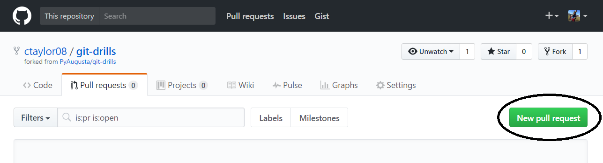
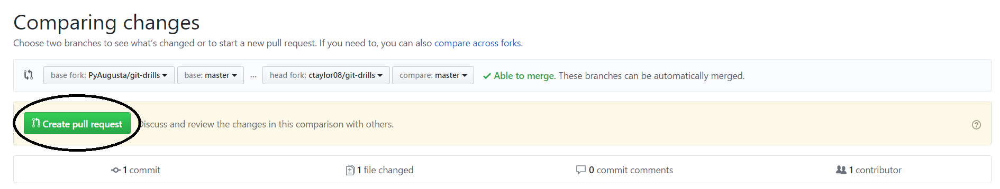
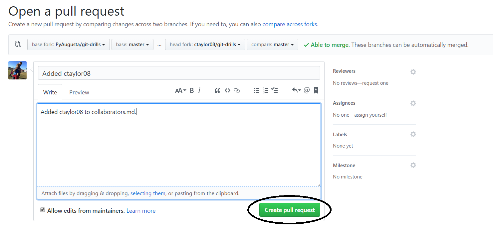

# Submit a pull request

Now that we've made our changes and merged them back into our fork's master branch, we're ready to submit a pull request. All of this can be done from the browser.

1. Go to your fork in GitHub, switch to the Pull Requests tab, and click the **New pull request** button.
    
    

2. Git will then automatically compare your fork with the main project repository, and display to you those changes. Once you've inspected the changes and are satisfied, click the green **Create pull request** button.

    

3. The final step is to update any comments and open the request by clicking the **Create pull request** button one more time.

    
