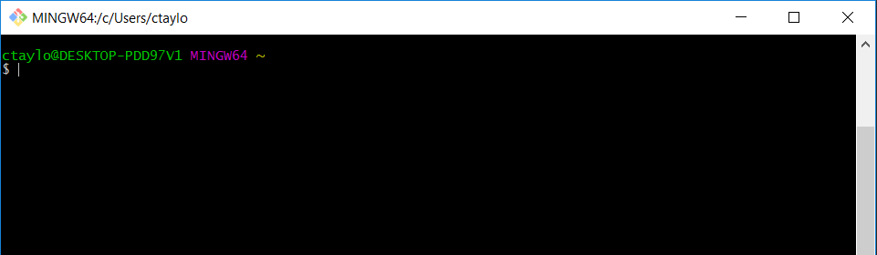

# Clone your fork
Now that you've created a fork (copy) of the project, you're ready to download it to you working computer. To do so, follow along with the below instructions.

*Sidenote*: You will need to have a GitHub account, downloaded the git shell, set up ssh, and forked a copy of this project's main repository.

1. Open the git shell you downloaded earlier. It should look something like this:



2. It's probably a good idea to create a directory where you can keep your clones. Type the following commands into your git shell.
    
    ```bash
    $ cd ~
    $ mkdir git_clones
    $ cd git_clones
    ```

    *hint*: the ```cd``` and ```mkdir``` commands allow you to move into and create new directories respectively.

3. From here, you can clone your fork by typing the following (replace your_username with whatever your GitHub username is).
    
    ```bash
    $ git clone git@github.com:your_username/git-drills.git
    ```
    When you hit enter the above command, you may be prompted for password you used to set up your SSH keys. You should then see some output messages. To confirm that the project was cloned successfully, run the ls command - you should see that a new folder called git-drills was created.
    
    ```bash
    $ ls
    ```
And there you have it. You have cloned your first repository!

In the [next lesson](7-create-a-branch.md), we'll learn how to create our own "feature branch".
